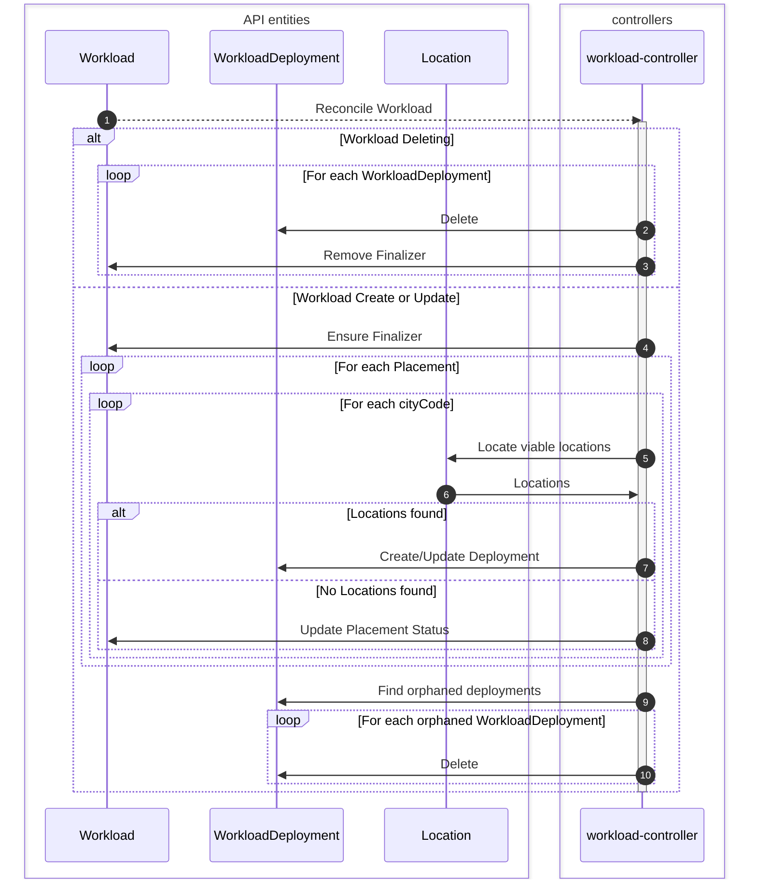
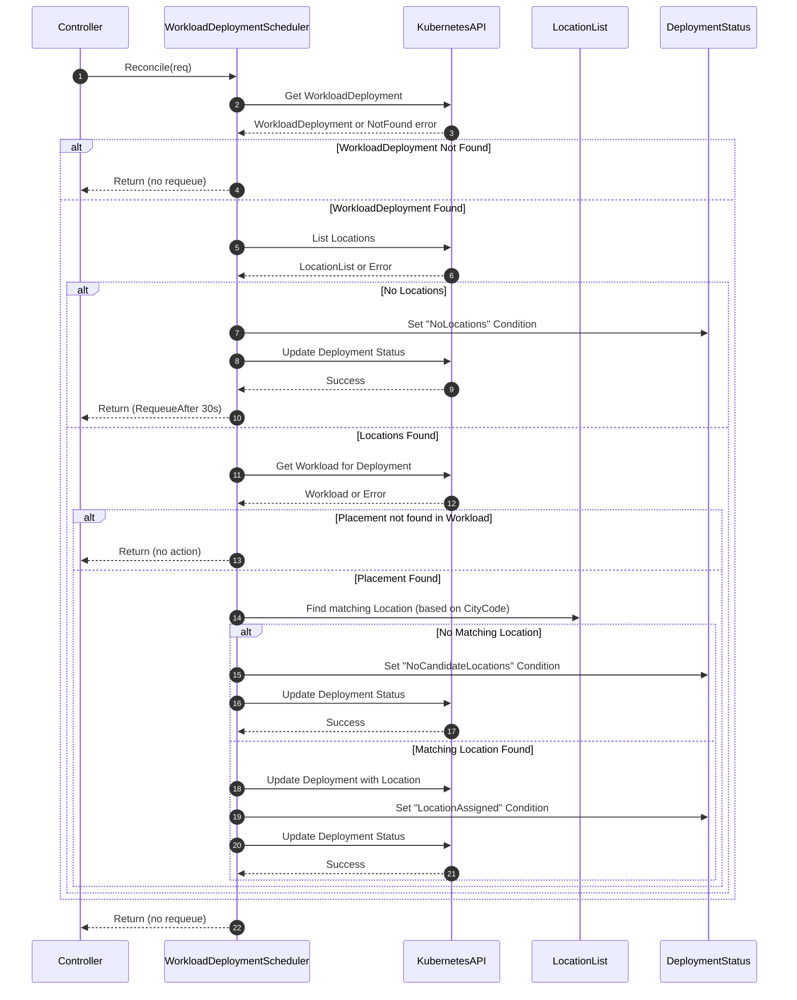

<!--
**Note:** When your RFC is complete, all of these comment blocks should be removed.

Just because a RFC is merged does not mean it is complete or approved. Any RFC
marked as `provisional` is a working document and subject to change. You can
denote sections that are under active debate as follows:

```
<<[UNRESOLVED optional short context or usernames ]>>
Stuff that is being argued.
<<[/UNRESOLVED]>>
```

When editing RFCs, aim for tightly-scoped, single-topic PRs to keep discussions
focused. If you disagree with what is already in a document, open a new PR
with suggested changes.

One RFC corresponds to one "feature" or "enhancement" for its whole lifecycle.
You do not need a new RFC to move from beta to GA, for example. If
new details emerge that belong in the RFC, edit the RFC. Once a feature has
become "implemented", major changes should get new RFCs.

The canonical place for the latest set of instructions (and the likely source
of this file) is [here](/docs/rfcs/template/README.md).

**Note:** Any PRs to move a RFC to `implementable`, or significant changes once
it is marked `implementable`, must be approved by each of the RFC approvers.
If none of those approvers are still appropriate, then changes to that list
should be approved by the remaining approvers and/or the owning SIG (or
SIG Architecture for cross-cutting RFCs).
-->

# Workloads

- [Summary](#summary)
- [Motivation](#motivation)
  - [Goals](#goals)
  - [Non-Goals](#non-goals)
- [Proposal](#proposal)
  - [User Stories (Optional)](#user-stories-optional)
  - [Notes/Constraints/Caveats (Optional)](#notesconstraintscaveats-optional)
  - [Risks and Mitigations](#risks-and-mitigations)
- [Design Details](#design-details)
  - [Workload Entity](#workload-entity)
  - [Control Loops](#control-loops)
- [Production Readiness Review Questionnaire](#production-readiness-review-questionnaire)
  - [Feature Enablement and Rollback](#feature-enablement-and-rollback)
  - [Rollout, Upgrade and Rollback Planning](#rollout-upgrade-and-rollback-planning)
  - [Monitoring Requirements](#monitoring-requirements)
  - [Dependencies](#dependencies)
  - [Scalability](#scalability)
  - [Troubleshooting](#troubleshooting)
- [Implementation History](#implementation-history)
- [Drawbacks](#drawbacks)
- [Alternatives](#alternatives)
- [Infrastructure Needed (Optional)](#infrastructure-needed-optional)

## Summary

This RFC defines a method for users to declaritively manage multiple deployments
of instances across many locations as a single logical entity in the form of a
Workload. As a Workload is a declarative entity, it is possible that the intent
described in the Workload may never be fully satisfied, however, the control
plane will constantly drive toward the desired state.

A Workload allows users to define the type of instances to deploy, where to
deploy them, and how to manage them.

The type of instance to deploy is influenced by many factors, such as:

- Instance resource requirements (CPU, Memory, Disk, Accelerators, etc)
- Runtime (Container or Virtual Machine)
- Runtime configuration (Environment Variables, Named Ports, Init Containers,
  Cloud-init)
- Network interfaces (Networks to attach to, Addressing configuration, IP
  Families)
- Volumes

The placement of instances can also be influenced by many factors, such as:

- An IATA airport code
- The minimum and maximum number of replicas
- Autoscaling settings, such as what metric to observe for scaling actions, or
  how quickly to scale up or down.
- Network topology constraints (future)

A Workload allows defining multiple deployment configurations to enable flexible
management of instances, such as an EU deployment requiring a larger number of
minimum replicas than a US deployment, or separate scaling settings.

## Motivation

### Goals

- Provide a single API call that can result in the deployment of many compute
  instances.
- Allow the definition of multi-container based instances that will be deployed
  in managed virtualized sandboxes.
- Allow the definition of virtual machine based instances.
- Allow attaching one or more network interfaces to the same or separate
  networks.
- Allow the definition of network interface specific network policies.
- Provide the ability to remotely manage instances via the use of serial console
  or VNC for virtual machine based instances, and remote container execution for
  container based instances.

### Non-Goals

- Direct definition of single instances.
- Define functionality of Datum Cloud Networks (A separate RFC will define this).

## Proposal

<!--
This is where we get down to the specifics of what the proposal actually is.
This should have enough detail that reviewers can understand exactly what
you're proposing, but should not include things like API designs or
implementation. What is the desired outcome and how do we measure success?.
The "Design Details" section below is for the real
nitty-gritty.
-->

### User Stories (Optional)

<!--
Detail the things that people will be able to do if this RFC is implemented.
Include as much detail as possible so that people can understand the "how" of
the system. The goal here is to make this feel real for users without getting
bogged down.
-->

#### Story 1

#### Story 2

### Notes/Constraints/Caveats (Optional)

<!--
What are the caveats to the proposal?
What are some important details that didn't come across above?
Go in to as much detail as necessary here.
This might be a good place to talk about core concepts and how they relate.
-->

### Risks and Mitigations

<!--
What are the risks of this proposal, and how do we mitigate? Think broadly.
For example, consider both security and how this will impact the larger
software ecosystem.

How will security be reviewed, and by whom?

How will UX be reviewed, and by whom?

Consider including folks who also work outside of your immediate team.
-->

## Design Details

### Workload Entity

Below is an example workload definition in YAML form:

> [!CAUTION]
> The structure below has not yet been finalized and is subject to change.

```yaml
apiVersion: compute.datumapis.com/v1alpha
kind: Workload
metadata:
  # The workloadId will influence the name of each instance in the workload. This
  # must be a valid DNS name.
  name: my-workload
  namespace: my-namespace
  uid: 6e3d1b5f-5d58-40ac-9c4a-b93433c672f9
  # Arbitrary string key/value entries that can be used to influence Datum Cloud
  # platform behaviors at a workload level, or the behavior of external systems
  # that may read these annotations.
  annotations:
    compute.datumapis.com/enable-anycast: "true"
  # Arbitrary string key/value entries that can be used in network policies,
  # services, discovery services (DNS discovery, Metadata API).
  # WILL NOT propagate to instances managed by the workload, allowing updates to
  # these labels without impacting the lifecycle of an instance.
  labels:
    tier: app
  creationTimestamp: 1970-01-01T00:00:00Z
# Defines the expectations of the workload
spec:
  # The template defines settings for each instance
  template:
    # Arbitrary string key/value entries that can be used in network policies,
    # services, discovery services (DNS discovery, Metadata API).
    #
    # Any changes to these labels may result in a lifecycle event of instances.
    labels:
      tier: app
    spec:
      # The runtime type of the instance, such as a set of containers or a VM.
      runtime:
        # Resources each instance must be allocated.
        #
        # A sandbox runtime's containers may specify resource requests and
        # limits. When limits are defined on all containers, they MUST consume
        # the entire amount of resources defined here.
        #
        # A virtual machine runtime will be provided all requested resources.
        resources:
          # Resources for an instance may be defined by referencing a pre
          # defined instance type, or by referencing an instance family and
          # providing specific resource requests for CPU, Memory, etc.
          #
          # Instance type is a required field.
          #
          # When customizing an instance type the value will be in the form
          # `<instanceFamily>-custom`.
          instanceType: datumcloud/d1-standard-2

          # Directly specifying desired resources.
          #
          # NOTE: This MUST be combined with `instanceType` being set to
          # reference an instance family.
          requests:
            cpu: "2"
            memory: "2Gi"
            # Example of a GPU attachment
            datumcloud.com/nvidia-tesla-a100: "1"
        # A sandbox is a managed isolated environment capable of running
        # containers. Each sandbox comes with its own kernel, isolated from the
        # host machine.
        #
        # NOTE: This field is mutually exclusive with `virtualMachine`.
        sandbox:
          # Multiple containers can be deployed in a single instance. They will
          # behave similar to a Kubernetes Pod in that they can interact over the
          # instance's network interfaces, and attached volumes.
          containers:
            - name: netdata
              # Only accept fully qualified container images so it's known where
              # the image is coming from. Otherwise, we'd have to decide on a list
              # of registries to fall back to, which can introduce security holes.
              image: docker.io/netdata/netdata
              # Resource requests and limits for the container.
              # This field is optional. If left undefined, there will be no
              # limits placed on the container beyond those imposed by the
              # amount of resources requested for the runtime.
              resources:
                # Optional resource requests for the container.
                #
                # Each resource type MUST also be defined in `runtime.resources`,
                # and cannot exceed the amount requested in `runtime.resources`.
                #
                # If only a single container is defined, resource requests must
                # either match those defined in `runtime.resources`, or leave
                # the field blank to permit all resources to the container.
                #
                # This can be helpful to hint the OS scheduler regarding resource
                # priority between multiple containers in the same instance.
                requests:
                  cpu: "1"
                  memory: "1Gi"
                # Optional resource limits for the container.
                #
                # If not set, the upper limit on container resource usage will
                # be the resources requested for the runtime.
                limits:
                  # The container CPU usage will be throttled to 1 cpu-second
                  # per second.
                  cpu: "1"
                  # If the container memory usage exceeds 1Gi, it will be
                  # terminated and restarted by the control plane.
                  memory: "1536Mi"
              volumeAttachments:
                - name: logs
                  mountPath: /app/logs
              # Named ports to be used in network policies and discovery services.
              ports:
                - name: http
                  port: 80
                - name: https
                  port: 443
            - name: sidecar
              image: docker.io/timberio/vector
              resources:
                requests:
                  cpu: "100m"
                  memory: "256m"
                limits:
                  cpu: "1"
                  memory: "512Mi"
              volumeAttachments:
                - name: logs
                  mountPath: /app/logs
        # A virtual machine is a classical VM environment, booting a full OS
        # provided by the user via an image.
        #
        # NOTE: This field is mutually exclusive with `sandbox`.
        virtualMachine:
          volumeAttachments:
            # A VM based instance must have a volume attached as the boot disk.
            # The `name` field must align with the `name` of a volume defined
            # in `spec.volumes`.
            #
            # The order of volumes is important, and the first volume will be
            # used to boot the VM's OS.
            - name: boot
            - name: logs
              # Specifies a unique device name that is reflected into the
              # `/dev/disk/by-id/datumcloud-*` tree of a Linux operating system
              # running within the instance. This name can be used to reference
              # the device for mounting, resizing, and so on, from within the
              # instance.
              #
              # If not specified, the server chooses a default device name to
              # apply to this disk, in the form persistent-disk-x, where x is a
              # number assigned by Datum Cloud.
              #
              # This field is only applicable for persistent disks.
              deviceName: logs

      # One or more network interfaces can be attached to each instance
      networkInterfaces:
        # A default network will exist in each project
        - network:
            name: default
          ipFamilies:
            - IPv4
            - IPv6
        # Additional networks can be created and attached to
        - network:
            name: corp
          ipFamilies:
            - IPv4

      # Volumes defines volumes that must be available to attach to an instance.
      #
      # Each volume may be of a different type, such as disk backed, backed by
      # downward API information, secrets, memory, etc.
      #
      # Mounting or presenting the volume to the instance is controlled via the
      # `volumeAttachments` field in a container or virtual machine settings.
      volumes:
        # Name will be used to reference the volume in `volumeAttachments` for
        # containers and VMs, and will be used to derive the platform resource
        # name when required by prefixing this name with the instance name upon
        # creation.
        - name: boot
          disk:
            template:
              spec:
                populator:
                  # Using a source image will default storage resource requests to
                  # the size of the source image.
                  image:
                    name: datumcloud/ubuntu-2204-lts
        - name: logs
          disk:
            template:
              spec:
                populator:
                  filesystem:
                    type: ext4
                resources:
                  requests:
                    storage: 10Gi

  # Defines where instances should be deployed, and at what scope a deployment
  # will live in (such as in a city, or region).
  #
  # Each placement will result in zero or more deployments. A deployment is
  # responsible for managing the lifecycle of instances within its scope.
  #
  # NOTE: Only the deployment scope of `cityCode` will be supported at this time.
  placements:
    # Basic examples of leveraging IATA airport codes to define expectations on
    # where deployments should be created.
    - name: us
      # Each city code which can accept the workload will result in a unique
      # deployment.
      #
      # In this case two deployments will be created, one in DFW and another in
      # SEA. In each of these deployments, there will be a minimum of 5
      # instances deployed.
      #
      # NOTE: A deployment may be created in a city that cannot currently meet
      # the minimum replica requirements of the placement. However, the control
      # plane will constantly work toward creating the replicas when capacity is
      # available.
      cityCodes: ['DFW', 'SEA']
      scaleSettings:
        minReplicas: 5
    # Same example as above, but to build different logical "regions".
    - name: eu
      cityCodes: ['LHR', 'AMS']
      scaleSettings:
        minReplicas: 3
    - name: oc
      cityCodes: ['SYD', 'MEL']
      scaleSettings:
        minReplicas: 3
    # Forward looking autoscaling based on external metrics. There is an
    # expectation that typical metrics that cover CPU and network related
    # concerns will be made available automatically.
    - name: us
      cityCodes: ['DFW', 'SEA']
      # Read
      # - https://kubernetes.io/docs/tasks/run-application/horizontal-pod-autoscale-walkthrough/
      # - https://kubernetes.io/docs/tasks/run-application/horizontal-pod-autoscale
      scaleSettings:
        minReplicas: 5
        maxReplicas: 10
        metrics:
          # The intent here is that `External` will interact with an external
          # metrics store owned by the user when making scaling decisions.
          #
          # In this example, the system will scale up or down instances with
          # the goal of meeting the target request latency.
          - external:
              metric:
                name: app:request_latency_ms:95
                selector:
                  # Metric in the external system must have labels that match
                  # the expected values.
                  matchLabels:
                    tier: app
                    # Implies the metric series has a label `city_code`
                    # with a value matching the IATA cityCode of a potential
                    # location for the deployment
                    city_code: "{{ context.locality.cityCode }}"
              target:
                type: AverageValue
                averageValue: 30

    # Future flexible format
    - name: test-eu
      # Scope for a deployment. Each unique value of the locality attributed
      # referenced will have a deployment created.
      #
      # For example, each `region` below may have one or more distinct cities
      # available. In this configuration, a deployment would be created in each
      # of those cities.
      # TODO(jreese) consider a fully qualified label such as `locality.datumcloud.com/cityCode`
      scope: cityCode
      selector:
        # CEL expression
        constraint: region in ['US', 'EU', 'OC']
      scaleSettings:
        minReplicas: 3
# Status is an output-only system populated field used to communicate
# information regarding the state of the workload.
#
# Status conditions are aggregated from WorkloadDeployments into each placement
# conditions, and from the placement condition to the workload conditions.
status:
  # Status of each placement
  placements:
    - name: us
      currentReplicas: 7
      desiredReplicas: 10
      conditions:
        - type: Available
          status: "True"
        - type: Progressing
          status: "False"
          reason: QuotaExhausted
          message: CPU quota has been exhausted in, please contact support.
    # ...
```

#### Minimum specifications

Below are examples of the minimum requirements for creating a container or VM
based workload.

##### Container based instance

```yaml
apiVersion: compute.datumapis.com/v1alpha
kind: Workload
metadata:
  name: my-container-workload
spec:
  template:
    spec:
      runtime:
        resources:
          instanceType: datumcloud/d1-standard-2
        sandbox:
          containers:
            - name: httpbin
              image: mccutchen/go-httpbin
      networkInterfaces:
        - network:
            name: default
  placements:
    - name: us
      cityCodes: ['DFW', 'SEA']
      scaleSettings:
        minReplicas: 1
```

##### VM based instance

```yaml
apiVersion: compute.datumapis.com/v1alpha
kind: Workload
metadata:
  name: my-vm-workload
spec:
  template:
    spec:
      runtime:
        resources:
          instanceType: datumcloud/d1-standard-2
        virtualMachine:
          volumeAttachments:
            - name: boot
      networkInterfaces:
        - network: default
      volumes:
        - name: boot
          disk:
            template:
              spec:
                populator:
                  image:
                    name: datumcloud/ubuntu-2204-lts
  placements:
    - name: us
      cityCodes: ['DFW', 'SEA']
      scaleSettings:
        minReplicas: 1
```

<!--
This section should contain enough information that the specifics of your
change are understandable. This may include API specs (though not always
required) or even code snippets. If there's any ambiguity about HOW your
proposal will be implemented, this is the place to discuss them.
-->

### Control Loops

#### Workload



#### Workload Scheduler



## Production Readiness Review Questionnaire

<!--

Production readiness reviews are intended to ensure that features are observable,
scalable and supportable; can be safely operated in production environments, and
can be disabled or rolled back in the event they cause increased failures in
production.

See more in the PRR RFC at https://git.k8s.io/enhancements/keps/sig-architecture/1194-prod-readiness.

The production readiness review questionnaire must be completed and approved
for the RFC to move to `implementable` status and be included in the release.
-->

### Feature Enablement and Rollback

<!--
This section must be completed when targeting alpha to a release.
-->

#### How can this feature be enabled / disabled in a live cluster?

<!--
Pick one of these and delete the rest.
-->

- [ ] Feature gate
  - Feature gate name:
  - Components depending on the feature gate:
- [ ] Other
  - Describe the mechanism:
  - Will enabling / disabling the feature require downtime of the control plane?
  - Will enabling / disabling the feature require downtime or reprovisioning of
    a node?

#### Does enabling the feature change any default behavior?

<!--
Any change of default behavior may be surprising to users or break existing
automations, so be extremely careful here.
-->

#### Can the feature be disabled once it has been enabled (i.e. can we roll back the enablement)?

<!--
Describe the consequences on existing workloads (e.g., if this is a runtime
feature, can it break the existing applications?).

Feature gates are typically disabled by setting the flag to `false` and
restarting the component. No other changes should be necessary to disable the
feature.
-->

#### What happens if we reenable the feature if it was previously rolled back?

#### Are there any tests for feature enablement/disablement?

### Rollout, Upgrade and Rollback Planning

<!--
This section must be completed when targeting beta to a release.
-->

#### How can a rollout or rollback fail? Can it impact already running workloads?

<!--
Try to be as paranoid as possible - e.g., what if some components will restart
mid-rollout?

Be sure to consider highly-available clusters, where, for example,
feature flags will be enabled on some servers and not others during the
rollout. Similarly, consider large clusters and how enablement/disablement
will rollout across nodes.
-->

#### What specific metrics should inform a rollback?

<!--
What signals should users be paying attention to when the feature is young
that might indicate a serious problem?
-->

#### Were upgrade and rollback tested? Was the upgrade->downgrade->upgrade path tested?

<!--
Describe manual testing that was done and the outcomes.
Longer term, we may want to require automated upgrade/rollback tests, but we
are missing a bunch of machinery and tooling and can't do that now.
-->

#### Is the rollout accompanied by any deprecations and/or removals of features, APIs, fields of API types, flags, etc.?

<!--
Even if applying deprecation policies, they may still surprise some users.
-->

### Monitoring Requirements

<!--
This section must be completed when targeting beta to a release.

For GA, this section is required: approvers should be able to confirm the
previous answers based on experience in the field.
-->

#### How can an operator determine if the feature is in use by workloads?

<!--
Ideally, this should be a metric. Operations against the API (e.g., checking if
there are objects with field X set) may be a last resort. Avoid logs or events
for this purpose.
-->

#### How can someone using this feature know that it is working for their instance?

<!--
For instance, if this is an instance-related feature, it should be possible to
determine if the feature is functioning properly for each individual instance.
Pick one more of these and delete the rest.
Please describe all items visible to end users below with sufficient detail so
that they can verify correct enablement and operation of this feature.
Recall that end users cannot usually observe component logs or access metrics.
-->

- [ ] Events
  - Event Reason:
- [ ] API .status
  - Condition name:
  - Other field:
- [ ] Other (treat as last resort)
  - Details:

#### What are the reasonable SLOs (Service Level Objectives) for the enhancement?

<!--
This is your opportunity to define what "normal" quality of service looks like
for a feature.

It's impossible to provide comprehensive guidance, but at the very
high level (needs more precise definitions) those may be things like:
  - per-day percentage of API calls finishing with 5XX errors <= 1%
  - 99% percentile over day of absolute value from (job creation time minus expected
    job creation time) for cron job <= 10%
  - 99.9% of /health requests per day finish with 200 code

These goals will help you determine what you need to measure (SLIs) in the next
question.
-->

#### What are the SLIs (Service Level Indicators) an operator can use to determine the health of the service?

<!--
Pick one more of these and delete the rest.
-->

- [ ] Metrics
  - Metric name:
  - [Optional] Aggregation method:
  - Components exposing the metric:
- [ ] Other (treat as last resort)
  - Details:

#### Are there any missing metrics that would be useful to have to improve observability of this feature?

<!--
Describe the metrics themselves and the reasons why they weren't added (e.g., cost,
implementation difficulties, etc.).
-->

### Dependencies

<!--
This section must be completed when targeting beta to a release.
-->

#### Does this feature depend on any specific services running in the cluster?

<!--
Think about both cluster-level services (e.g. metrics-server) as well
as node-level agents (e.g. specific version of CRI). Focus on external or
optional services that are needed. For example, if this feature depends on
a cloud provider API, or upon an external software-defined storage or network
control plane.

For each of these, fill in the following—thinking about running existing user workloads
and creating new ones, as well as about cluster-level services (e.g. DNS):
  - [Dependency name]
    - Usage description:
      - Impact of its outage on the feature:
      - Impact of its degraded performance or high-error rates on the feature:
-->

### Scalability

<!--
For alpha, this section is encouraged: reviewers should consider these questions
and attempt to answer them.

For beta, this section is required: reviewers must answer these questions.

For GA, this section is required: approvers should be able to confirm the
previous answers based on experience in the field.
-->

#### Will enabling / using this feature result in any new API calls?

<!--
Describe them, providing:
  - API call type (e.g. PATCH workloads)
  - estimated throughput
  - originating component(s) (e.g. Workload, Network, Controllers)
Focusing mostly on:
  - components listing and/or watching resources they didn't before
  - API calls that may be triggered by changes of some resources
    (e.g. update of object X triggers new updates of object Y)
  - periodic API calls to reconcile state (e.g. periodic fetching state,
    heartbeats, leader election, etc.)
-->

#### Will enabling / using this feature result in introducing new API types?

<!--
Describe them, providing:
  - API type
  - Supported number of objects per cluster
  - Supported number of objects per namespace (for namespace-scoped objects)
-->

#### Will enabling / using this feature result in any new calls to the cloud provider?

<!--
Describe them, providing:
  - Which API(s):
  - Estimated increase:
-->

#### Will enabling / using this feature result in increasing size or count of the existing API objects?

<!--
Describe them, providing:
  - API type(s):
  - Estimated increase in size: (e.g., new annotation of size 32B)
  - Estimated amount of new objects: (e.g., new Object X for every existing Pod)
-->

#### Will enabling / using this feature result in increasing time taken by any operations covered by existing SLIs/SLOs?

<!--
Look at the [existing SLIs/SLOs].

Think about adding additional work or introducing new steps in between
(e.g. need to do X to start a container), etc. Please describe the details.

[existing SLIs/SLOs]: https://git.k8s.io/community/sig-scalability/slos/slos.md#kubernetes-slisslos
-->

#### Will enabling / using this feature result in non-negligible increase of resource usage in any components?

<!--
Things to keep in mind include: additional in-memory state, additional
non-trivial computations, excessive access to disks (including increased log
volume), significant amount of data sent and/or received over network, etc.
This through this both in small and large cases, again with respect to the
[supported limits].

[supported limits]: https://git.k8s.io/community//sig-scalability/configs-and-limits/thresholds.md
-->

#### Can enabling / using this feature result in resource exhaustion of some node resources (PIDs, sockets, inodes, etc.)?

<!--
Focus not just on happy cases, but primarily on more pathological cases.

Are there any tests that were run/should be run to understand performance
characteristics better and validate the declared limits?
-->

### Troubleshooting

<!--
This section must be completed when targeting beta to a release.

For GA, this section is required: approvers should be able to confirm the
previous answers based on experience in the field.

The Troubleshooting section currently serves the `Playbook` role. We may consider
splitting it into a dedicated `Playbook` document (potentially with some monitoring
details). For now, we leave it here.
-->

#### How does this feature react if the API server is unavailable?

#### What are other known failure modes?

<!--
For each of them, fill in the following information by copying the below template:
  - [Failure mode brief description]
    - Detection: How can it be detected via metrics? Stated another way:
      how can an operator troubleshoot without logging into a master or worker node?
    - Mitigations: What can be done to stop the bleeding, especially for already
      running user workloads?
    - Diagnostics: What are the useful log messages and their required logging
      levels that could help debug the issue?
      Not required until feature graduated to beta.
    - Testing: Are there any tests for failure mode? If not, describe why.
-->

#### What steps should be taken if SLOs are not being met to determine the problem?

## Implementation History

<!--
Major milestones in the lifecycle of a RFC should be tracked in this section.
Major milestones might include:
- the `Summary` and `Motivation` sections being merged, signaling acceptance
- the `Proposal` section being merged, signaling agreement on a proposed design
- the date implementation started
- the first release where an initial version of the RFC was available
- the version where the RFC graduated to general availability
- when the RFC was retired or superseded
-->

## Drawbacks

<!--
Why should this RFC _not_ be implemented?
-->

## Alternatives

<!--
What other approaches did you consider, and why did you rule them out? These do
not need to be as detailed as the proposal, but should include enough
information to express the idea and why it was not acceptable.
-->

## Infrastructure Needed (Optional)

<!--
Use this section if you need things from another party. Examples include a
new repos, external services, compute infrastructure.
-->
