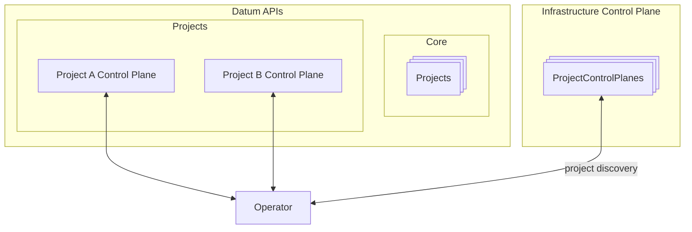
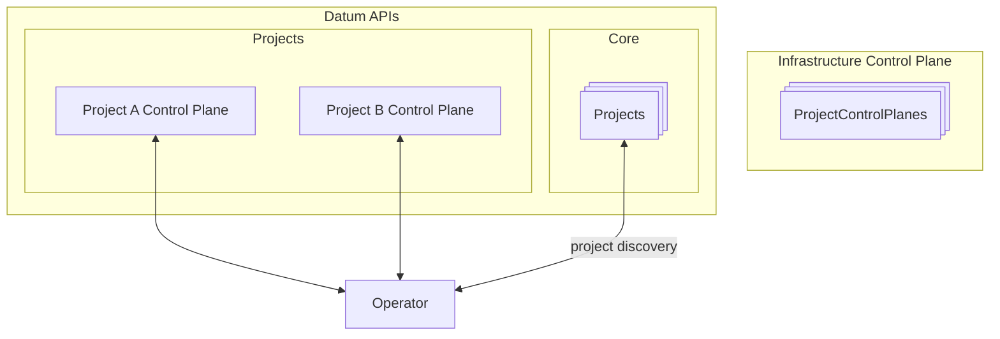

# Discovery Modes

## ProjectControlPlane

```mermaid
flowchart TD
  operator[Operator]


  subgraph infrastructureControlPlane[Infrastructure Control Plane]
    datumProjectControlPlanes[ProjectControlPlanes]@{ shape: procs }
  end

  subgraph "Datum APIs"
    subgraph "Core"
      datumProjects[Projects]@{ shape: procs }
    end

    subgraph "Projects"
      datumProjectAControlPlane[Project A Control Plane]
      datumProjectBControlPlane[Project B Control Plane]
    end
  end

  datumProjectAControlPlane <--> operator
  datumProjectBControlPlane <--> operator
  datumProjectControlPlanes <--project discovery--> operator


```

## Project

```mermaid
flowchart TD
  operator[Operator]


  subgraph infrastructureControlPlane[Infrastructure Control Plane]
    datumProjectControlPlanes[ProjectControlPlanes]@{ shape: procs }
  end

  subgraph "Datum APIs"
    subgraph "Core"
      datumProjects[Projects]@{ shape: procs }
    end

    subgraph "Projects"
      datumProjectAControlPlane[Project A Control Plane]
      datumProjectBControlPlane[Project B Control Plane]
    end
  end

  datumProjectAControlPlane <--> operator
  datumProjectBControlPlane <--> operator
  datumProjects <--project discovery--> operator
```
